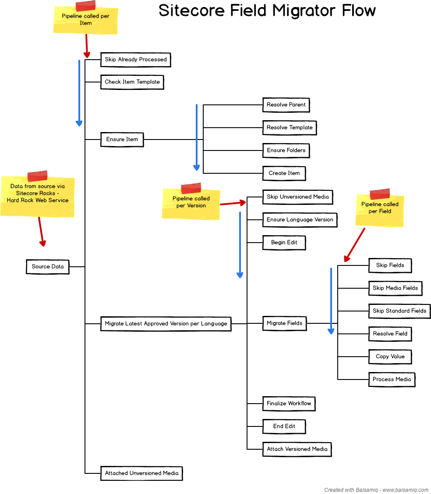

# Sitecore Field Migrator Module #

> Note: This module supports Sitecore 8.1+ as a target.  Source versions have been tested from Sitecore 6.6.

## Overview ##

The Sitecore Field Migrator allows migration of item field content from one instance of Sitecore to another.
Only the items and field values specified are actually copied.
Currently, the Field Migrator only support moving Content and Media Items, and their fields values.
The primary use of this migrator would be to move data from one version of Sitecore to another without the need to upgrade.
Using this took makes the most sense when a Sitecore site is being redesigned and rebuilt on a newer version of Sitecore.
In this case only the content is to be copied, layouts and other data will be different in the new site and does not need to be migrated.

The migrator runs in the context of the target site.
Data is pulled from the source site using the Hard Rocks Web Service provided by Sitecore Rocks.
All steps in the process can be customized without impacting other steps.

### Features ###

Here are the key features of the Field Migrator:

1. Migrate item field data from one Sitecore instance to another.
1. Uses the Hard Rock Web Service from Sitecore Rocks on the source instance.
1. Based on pipelines for easy logic replacement.
1. Re-runable - The migration can be run over and over to migrate live production data to the new site.
1. Configuration driven
1. Migration can be triggered via web page or api call.
1. Items
    1. Configure the root node(s) to migrate.  All children are migrated.
    1. Configure the items based on templates to include/exclude when migrating.
        1. All children of a parent based on a template type can automatically be included.
    1. Configure media items based on templates to automatically migrate. (media is automatically discovered and migrated)
    1. Can re-map Item IDs.
    1. Can re-map Template IDs.
    1. Can re-map Parent IDs.
    1. Items can be automatically created if missing.
    1. Items are automatically updated based on fields from source system.
1. Versions
    1. Can re-map languages.
    1. Out of the box, the latest approved version is migrated.
1. Fields
    1. Ability to skip fields.
    1. Automatically skips standard fields with configurable exceptions.
    1. Can re-map fields.
    1. Automatically detects media references to import media.
    
### Data Flow ###

Here is a typical data flow through the pipelines.  The pipeline steps can be added, removed, and replaced.

## Installation ##

Components need to be installed on both the **Source** and **Target** Sitecore instances.

### Source Sitecore Instance ###

The Hard Rocks web service needs to be installed on the source instance of Sitecore.
One way to install it is to perform the following steps:

1. Install Sitecore Rocks into Visual Studio.
1. Setup Sitecore Rocks to point to the Source instance of Sitecore.
    1. Configure it to use the Hard Rocks web service.

### Target Sitecore Instance ###

There are a few approaches for installation on the target system:

1. Install the .update package using the Update Installation Wizard.
1. Pull down the source code and update the TDS.Master project to point to the target Sitecore Instance.  Build the project to deploy it.
1. Pull down the source code and compile.
    1. Copy the resulting OneNorth.FieldMigrator.dll to your Sitecore instance.
    1. Copy the App_Config/Include/z.OneNorth.FieldMigrator.config to your Sitecore instance.

> Note: you may want to create a branch / fork of this project to store any customizations.

## Configuration ##

The Field Migrator migrates field data based on what has been configured.
The configuration must be updated to support the data requirements.

The configuration is located in the **App_Config/Include/z.OneNorth.FieldMigrator.config**
It can be broken down into a few parts.
The configration is organized from more general stuff at the top to more specific at the bottom.

* **fieldmigrator** - Holds common general configuration such as source and target system info, the roots to migrate, and the templates to include.
* **migrateItem pipeline** - Holds the pipeline steps that manage migrating at the item level.
* **createItem pipeline** - In charge of creating items when they dont exist in the target instance.
* **migrateVersion pipeline** - Holds the pipeline steps that manage migrating at the version level.
* **migrateField pipeline** - Holds the pipeline steps that manage migrating at the field level.
* **database/events** - There are various settings to improve the performance of the field migrator.  These are meant to be temporary and should be removed when not running a migration.

Here is a [link](src/OneNorth.FieldMigrator/App_Config/Include/z.OneNorth.FieldMigrator.config) to the configuarion file that is provided out of the box.
The various settings are commented directly in the configuration file.

## Running ##

The migrator can be run by navigating to: /sitecore/admin/FieldMigrator/Default.aspx.
Click the **Run Field Migrator** button.

> Note: there is no progress indicator.
You can check the Sitecore logs for an indication of progress.
[BareTale](https://www.baremetalsoft.com/baretail/) provides a way to monitor logs in real time.

You may need to perform the following steps after running the migrator:
* Publish the items that were migrated
* Rebuild indexes.

# License #

The associated code is released under the terms of the [MIT license](http://onenorth.mit-license.org).